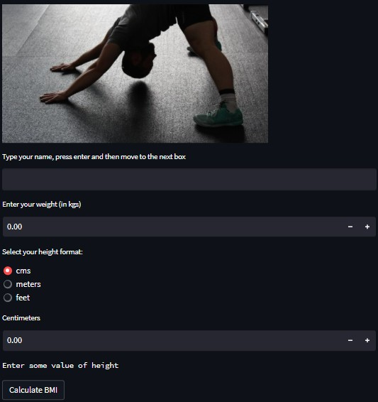

# 🧮 Simeon's BMI Calculator

A simple yet informative Body Mass Index (BMI) calculator built using **Streamlit**, designed to help users assess their weight category based on their height and weight inputs.

---

## 📌 Overview

The **Body Mass Index (BMI)** is a quick, non-invasive method used globally to estimate a person's body fat and assess their risk for health issues related to underweight, overweight, or obesity. This application provides:

- An intuitive interface to calculate BMI using various height units (cm, meters, feet).
- Personalized feedback based on the user's BMI classification.
- Health resources and actionable tips depending on the result.

---

## 🚀 Features

- 🌍 **Multi-unit support** for height input (cm, meters, feet)
- 📊 **Instant BMI calculation and category interpretation**
- 🧠 **Health advice** with links to credible sources
- 🧑‍⚕️ Clear warnings for critical BMI ranges
- 🎨 Visually enhanced with images and clean UI using **Streamlit**

---

## 💡 Technologies Used

- [Streamlit](https://streamlit.io/)
- [Python](https://www.python.org/)
- [Pillow (PIL)](https://pillow.readthedocs.io/en/stable/) – for image rendering

---

## 🧪 Limitations

While BMI is a useful general indicator, it doesn't account for factors such as muscle mass, bone density, age, or sex. It should **not** be used as a sole diagnostic tool. Always consult a healthcare professional for comprehensive assessment.

---

## ✅ How to Use

1. Open the [BMI App](https://bmi-app-5gl5j5le7bs.streamlit.app)
2. Enter your name, weight, and height.
3. Choose your height unit (cm, meters, or feet).
4. Click **"Calculate BMI"** to view your results and get health advice.

---

## 📸 Preview

  
*Example of BMI feedback based on input*

---

## 🧑‍💻 Author

**Simeon Ifalore**  
Lead Data Analyst | Data Science Instructor  
🔗 [LinkedIn](https://linkedin.com/in/simeon-ifalore) • 📧 simeon@example.com
